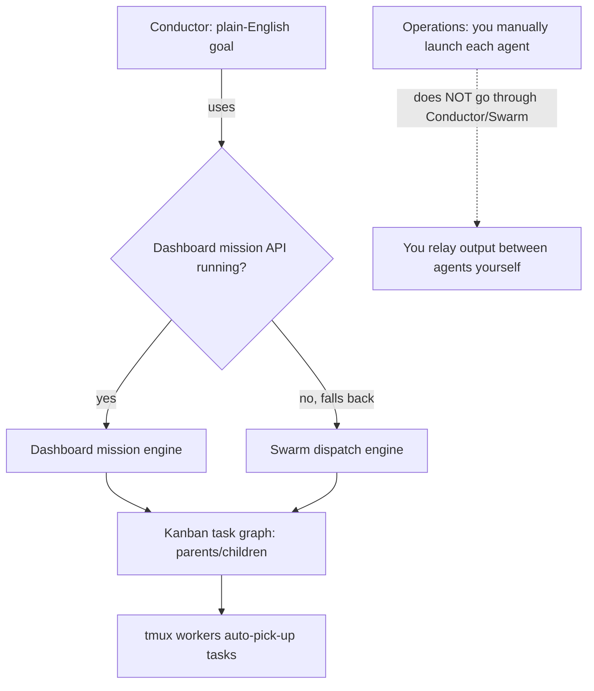
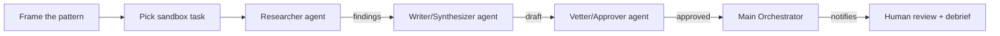
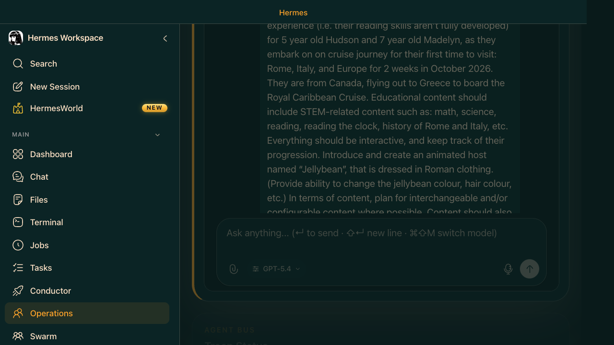
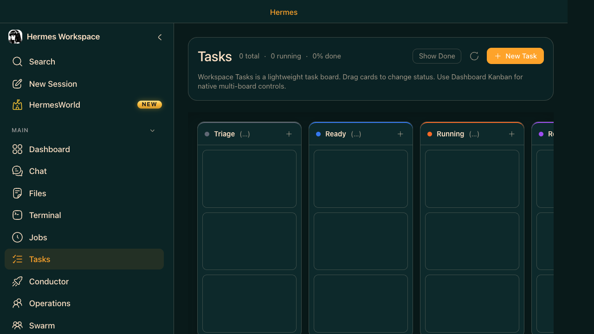
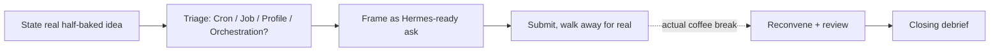
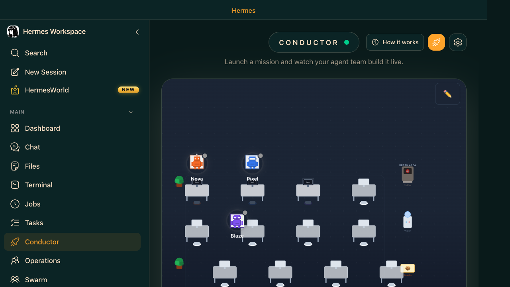
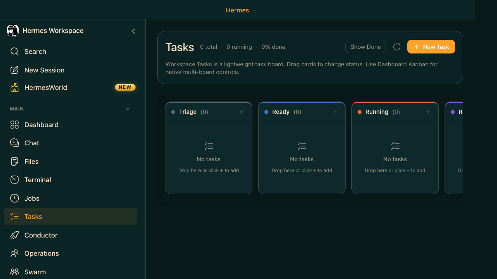
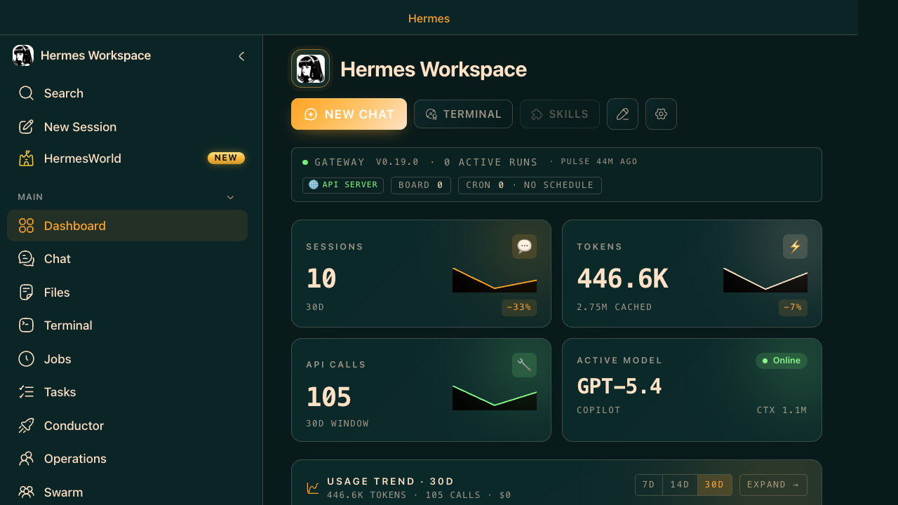

# Hermes Agent — Vibe Coder Onboarding Agenda

> STATUS: DRAFT — open for edits/additions. Not finalized.

## Vibe Coder Baseline (Phase 1 output)
```
Access confirmed: Yes — logged in, Workspace UI reachable
Prior Hermes exposure: Has run at least one job/task before
Prior agent-mode experience: Yes (Copilot agent mode / ChatGPT-with-tools / Cursor)
Mental model gaps: Knows SOME of Job/Task/Conductor/Swarm, not all
Real goal: Understand + execute multi-agent orchestration. Workflow pattern:
           "half-baked idea -> walk away (coffee break) -> completed
           draft/demo/POC/code"
Wants real task or sandbox: Sandbox/practice example first
Pacing preference: Watch it run first, ask questions after
```

## Phase 0 — Environment Verification (done)
- Hermes Agent gateway running on localhost:8642
- Hermes Workspace UI running on localhost:3000
- Copilot auth valid, single clean credential
- No corporate restrictions encountered

## Core Mechanics to Teach (grounded in Hermes Agent Training docs 06-09, 13)
Insert this as a short explainer block inside Phase 2, step 2.1, tailored to baseline gaps only.

**1. How an agent is defined**
- An agent = a **Profile** (Operations view): a saved config of tools/model/skills/behavior.
- Built-in starter presets: Sage (research/analysis), Builder (code), Scribe (docs), Ops (infra), Trader.
- These are *defaults*, not fixed roles — can be used as-is or customized.
- In Swarm mode, the equivalent is a **worker role**: builder, reviewer, docs, research, ops, triage.

**2. How work passes from one agent to another**
- **Conductor**: you describe a goal in plain English; Conductor decomposes it into subtasks and assigns them to a pool of worker agents (shown as roster labels e.g. Nova/Pixel/Blaze — just labels, not special personas).
- **Swarm**: tasks flow through Kanban columns; e.g. `triage` role decomposes/specifies incoming Triage-column tasks before `builder` picks them up as Ready → Running. Reviewer picks up after builder finishes, docs after reviewer approves.
- Handoff is column-based (Kanban) or checkpoint-based (Conductor mission slices reporting progress).

**3. How an agent knows there's work for it**
- **Kanban dispatch**: `hermes kanban dispatch` runs one dispatcher pass that assigns Ready tasks to available agents. Dragging a card to "Ready" makes it eligible for pickup.
- **Swarm workers**: persistent tmux-backed workers continuously poll the Board tab for tasks matching their role.
- **Conductor**: no manual dispatch needed — submitting a mission goal directly triggers decomposition and assignment.

**4. Visual views — what each one shows**
| View | Purpose | Columns/Tabs |
|---|---|---|
| **Tasks (Kanban)** | Main task board, bridge between "things to do" and "agent doing them" | Triage → Ready → Running → Review → Done |
| **Conductor** | Mission control for plain-English goals | New Mission, Agent team (roster + status), Mission list, Live updates |
| **Operations** | Multi-agent console, profile management | Overview (live grid of running agents), Outputs (consolidated output), New Agent |
| **Swarm** | Autonomous overnight worker pool | Control, Board (Kanban view), Inbox (completed/blockers), Runtime (live tmux logs), Reports (checkpoint summaries) |

**5. Where outputs / interim results live**
- **Operations → Outputs tab**: consolidated output from all running agents.
- **Swarm → Inbox tab**: completed work, blockers, and handoffs waiting for human review.
- **Swarm → Reports tab**: checkpoint summaries and proof-bearing work records (useful for the "walk away and come back" pattern).
- **Kanban → Review column**: agent finished, waiting for human review before marking Done.
- **Memory Browser**: cross-session facts/history in `MEMORY.md`, searchable (FTS5) — useful if they want to see what Hermes "remembers" from a prior run.

Teaching emphasis: since their real goal is "walk away, come back to a result," the **Swarm Inbox/Reports** and **Operations Outputs** tabs are the most important views to demo — that's literally where the coffee-break payoff shows up.

## ELI10: Conductor vs. Operations vs. Swarm
Three different ways to get agents working, from most-automated to most-manual.



**Conductor** = "tell it the goal, it plans the graph for you." You type a plain-English mission; Conductor decides how to break it into tasks and who does what. It has no separate engine of its own — it either calls the Dashboard's mission API (if `hermes dashboard` is running) or falls back to the same Swarm graph-creation mechanism as `hermes kanban swarm`. **Conductor is a planner sitting on top of Swarm, not a separate system.**

**Swarm** = the actual engine room. `hermes kanban swarm` creates the real task graph (parent/child cards: workers → verifier → synthesizer), and tmux-backed worker processes are supposed to auto-pick-up tasks from that graph. This is what Conductor calls internally when you don't specify the graph yourself. It's also the layer with the confirmed zsh bug (see "Verified Live Run" section below) — meaning **anything routed through Swarm, including Conductor missions, can hit that bug**, not just direct Swarm calls.

**Operations** = the manual, no-automation path. You launch each agent yourself, one at a time, and *you* are the relay — copying one agent's output into the next agent's prompt. It **never touches Conductor or Swarm at all**. This is what the "Verified Live Run" pipeline below actually used, specifically because Swarm was broken.

**Is there a valid reason to call each directly?**

| Call this directly when... | Why |
|---|---|
| **Conductor** | You have a real goal but don't want to plan the task breakdown yourself — let it decide roles/tasks. Best default entry point for a fresh idea. |
| **Swarm (`hermes kanban swarm` CLI)** | You already know the exact decomposition you want (specific roles, specific worker count) and want deterministic, scriptable control without Conductor's own interpretation layer — e.g. for repeatable automation. |
| **Operations** | Swarm/Conductor is broken or unavailable, you want full manual visibility/control over each step, or the job is small enough that being the relay yourself is easy and gives the clearest audit trail. |

### Interacting with agents directly, beyond Conductor
Conductor is the friendliest front door, but it is not the only — or even the required — way to work with agents:
- **You can always drop down a level and talk to an individual agent directly**, whether that's an Operations profile session (Chat tab for that agent) or a single worker's tmux pane spawned by Swarm. Nothing requires you to go through Conductor's plain-English mission layer if you already know exactly which agent you want to talk to and what you want it to do.
- **This is not a workaround or a "lesser" path** — it's a legitimate, sometimes better choice: more transparent (you see exactly what each agent said/received), more debuggable (you can isolate exactly which agent is misbehaving), and fully unaffected by bugs in the orchestration layer above it (Conductor/Swarm).
- **Trade-off:** going direct means *you* become the router/relay between agents — there's no automatic handoff, so you're responsible for passing context from one agent to the next (exactly what happened in the Verified Live Run below). For a small number of agents (2-4), this is very manageable; it does not scale well to dozens of agents, which is where Conductor/Swarm's automatic dispatch earns its keep.
- **Practical rule of thumb:** start with Conductor for a new, not-yet-understood goal; drop to direct Operations agent-by-agent interaction when Conductor/Swarm is unavailable, misbehaving, or when you specifically want the transparency of being the relay yourself.

## Pre-Installed / Pre-Defined Agents (grounded in 08-operations.html, 09-swarm.html)
These are not fixed roles — all are editable/replaceable starter presets.

**Operations profiles (5 built-in):**
| Profile | Optimized for | Best for |
|---|---|---|
| 🧠 Sage | Web search, document reading, synthesis | Market research, competitive analysis, summarizing docs |
| 🔨 Builder | Full tool access (terminal + file editing) | Feature development, debugging, refactoring |
| ✍️ Scribe | Long-form writing, structured markdown | Docs, reports, READMEs |
| ⚙️ Ops | Terminal-heavy, system-focused | Deployments, log analysis, health checks |
| 📊 Trader | CSV/data processing, quantitative work | Financial models, data pipelines, reporting |

**Swarm worker roles (6 built-in):**
| Role | Function |
|---|---|
| 🔨 builder | Writes/edits code; full terminal + file access; takes Ready→Running |
| 🔍 reviewer | Reviews completed work, runs tests, approves/requests changes |
| 📝 docs | Writes documentation/READMEs/changelogs from completed work |
| 🔬 research | Web search, reads docs, summarizes for other workers |
| ⚙️ ops | Infra tasks: deployments, config, health checks, CI |
| 🗂️ triage | Decomposes/specifies incoming Triage tasks before builders pick them up |

Teaching note: emphasize these are *starter defaults*, not the ceiling — the vibe coder never needs to hand-build a persona to get going.

## Known Beta / Unstable Areas — What's Actually Documented vs. What We Observed
Important caveat: the Hermes training docs do **not** ship an explicit "beta/stable" feature matrix. The items below are everything I could find or personally verify — flagged by confidence level so nothing is presented as more certain than it is.

**Documented in training material (medium confidence — stated directly in docs):**
- **Workspace "Tasks" board is explicitly called a "lightweight preview"** — the training exercise (15-exercise-kanban) tells users to use the full Hermes Dashboard (`localhost:9119/kanban`) instead for serious Kanban work, since it has "all columns, drag-drop, and dispatcher controls" that the Workspace preview lacks.
- **Conductor has a fallback mode**: it uses the Dashboard mission API when `hermes dashboard` is running; when that endpoint is absent, it silently falls back to native Swarm dispatch. Docs claim "both paths produce the same result," but this dual-path behavior is worth flagging as a potential source of inconsistent behavior between environments.

**Observed directly in this session (high confidence — we hit these ourselves):**
- The Hermes gateway's *previous* life exited **uncleanly** (SIGKILL/OOM, no clean exit path) before we restarted it today — a real stability signal, not hypothetical.
- Getting Hermes ↔ Copilot talking reliably on this machine required several manual workarounds previously (TLS/cert trust fix via `pip-system-certs`+`truststore`, an SSL-guard bypass env var, and removing a stale duplicate Copilot credential that caused intermittent 401s). None of this is exposed as "beta" in the UI — it just silently fails until patched.
- Workspace dev server needed a specific `gateway run --replace` startup pattern to avoid port 8642 bind flapping on restart — another undocumented rough edge. Caveat: `--replace` can itself race and kill the running gateway without successfully rebinding, leaving the gateway fully down — if that happens, just run a plain `hermes gateway run` once the port is confirmed free.
- **CONFIRMED + FIXED: Swarm workers crash on launch under zsh.** `hermes kanban swarm` always creates the task graph correctly, but the tmux-backed worker launcher (`hermes-workspace/src/routes/api/swarm-dispatch.ts`, `buildHermesTmuxLaunchCommand`) captured each worker's exit code with `status=$?` — `status` is a **read-only reserved variable in zsh** (macOS/most Linux default shell), so every worker (researcher/reviewer/builder/etc.) crashed immediately on launch, unconditionally, before doing any real work. Reproduced directly (`zsh -c 'status=$?'` → `zsh: read-only variable: status`) and confirmed **not** a network/corporate-proxy issue (npm registry reachable, 200 OK). **Fix applied and verified:** renamed the variable to `exit_code`; re-tested the corrected command in a real zsh tmux pane — works cleanly. No existing public GitHub issue found for this upstream as of 2026-09-06. **Portable across machines:** if a vibe coder hits this same symptom on a different computer, check that exact file/function for `status=$?` and rename it — full writeup in `/memories/hermes-agent-portable-fixes.md` (user-level memory, applies across workspaces).
- **Operations profile defaults can mismatch their advertised purpose.** The built-in "Sage" profile's actual default system prompt is an X/Twitter growth-marketing persona — not "research and analysis" as the training docs describe. Expect to customize the system prompt/description per task every time; "pre-installed" only means a starting point, not a ready-made fit.

**Not verified either way (recommend caution, don't teach as fact):**
- Per-profile model override config (`~/.hermes/profiles/<name>/config.yaml`) is marked "Advanced only — optional" in the docs, with an explicit warning that most users should skip it. Treat as experimental/power-user territory rather than beta, but keep it out of the 30-minute session either way.
- No confirmation of MCP server integration stability — docs present it as available but don't comment on maturity.

Teaching guidance: don't surface this list to the vibe coder as a formal "beta feature warning" (it would undermine confidence unnecessarily) — instead, quietly steer the demo toward the paths we know are solid (Kanban dispatch, Conductor, Swarm Inbox/Reports, Operations Outputs) and avoid the Workspace Tasks preview and per-profile model overrides during the live session.

## LOOP vs GRAPH Engineering (grounded in 14-agent-chaining.html, 17-exercise-pipeline.html)
Hermes has two distinct orchestration shapes worth naming, even briefly:

- **GRAPH** — a one-time task graph with dependencies: parallel worker tasks that converge into a gate/reviewer, then a final synthesizer (e.g. `hermes kanban swarm "goal" --worker researcher:task --verifier reviewer --synthesizer writer` creates an atomic graph: 3 parallel researchers → 1 reviewer waits for all 3 → 1 writer waits for reviewer). Parent-child links carry each task's output/context forward automatically (`kanban_show()`), visible on the Kanban board as a task graph.
- **LOOP** — the same shape, but run repeatedly on a schedule (docs example: "Competitive Intelligence Loop" — same pipeline as the graph example, but on a weekly cron, re-running the identical worker→reviewer→writer graph each time and delivering to Slack).

**Why this matters for this specific vibe coder:** per their baseline, their inputs right now are scattered — random half-formed ideas, some research-y, some spanning different unrelated tools/technologies, not a single repeatable business process yet. That means:
- **GRAPH is the right starting mental model, not LOOP.** A graph handles "here's one messy multi-part idea, break it into dependent pieces, converge on one result" — exactly their coffee-break pattern. It requires no assumption of repeatability.
- **LOOP only becomes relevant later**, once/if one of their ideas turns into something they'd want to repeat unchanged (e.g., a weekly report). Don't introduce LOOP as something they need today — mention it only as "this exists for later, once an idea becomes a repeatable process," so they don't feel pressure to force their scattered ideas into a rigid recurring workflow prematurely.
- Practically: their "half-baked idea → walk away → completed artifact" workflow **is** a graph execution (Conductor/Swarm decomposition → parallel work → converged synthesis), not a loop. Frame it that way explicitly so they don't conflate "orchestration" with "automation that must repeat."

Teaching placement: mention this distinction briefly in Phase 2 step 2.1 (one sentence: "what you're about to see is a graph — a one-time dependency chain, not a recurring loop") and revisit in Phase 3 step 5 debrief only if they ask "can this run automatically every week" — that's the natural cue to introduce LOOP.

## Maturity Tiering: First Step / Advanced / Unstable
Grounded directly in the curriculum's own guidance (index.html "Safe-to-try path for vibe coders") plus what we've verified ourselves.

**Tier 1 — First Step (safe to explore immediately, no orchestration risk)**
Per the docs' own words: *"Safe to explore first: chat, workspace browse, memory, skills, jobs, tasks, files, terminal."*
- Workspace Chat, Jobs, Tasks/Kanban (single-agent dispatch), Memory & Skills, Files & Terminal.
- Good for building comfort with the UI before touching multi-agent flows. Not orchestration yet — don't let the vibe coder claim "I did multi-agent orchestration" from this tier alone.

**Tier 2 — Advanced / Real Multi-Agent Orchestration (this is the actual goal)**
Per the docs' own recommended path: *"If you want orchestration: 07 (Conductor) → 08 (Operations) → 09 (Swarm) → 14 (Agent Chaining) → 15/16/17 (Exercises)."*
- This is the tier that produces a *legitimate, tangible claim* of multi-agent orchestration. Concrete, checkable criteria (taken directly from the training exercises' own "Expected Output" bars):
  - **Operations**: 2+ agent sessions visibly running concurrently in the Overview grid, each with a distinct task and distinct output in the Outputs tab.
  - **Swarm/Conductor**: a task graph exists with parent-child links — parallel worker tasks converging into a reviewer gate and/or synthesizer — visible on the Kanban/Dashboard board, with at least one worker's output flowing into the next task's context automatically.
- **Bar for "I did multi-agent orchestration" to be true, not just vibes:** at least 2 *distinct agents* with a real handoff of output/context between them (one agent's result feeds another's input). **Correction from an earlier draft of this doc:** concurrency is NOT required — sequential handoff (researcher → writer → reviewer, one after another) is a legitimate, common real-world orchestration pattern (matches LangGraph/CrewAI/AutoGen conventions). What disqualifies a run is a *single* agent doing every step itself in one session (e.g., one agent making 3 web searches back-to-back) — that's a multi-step task, not multi-agent, no matter how many tool calls happen internally.
- Docs explicitly require the gateway + dashboard verified running *before* attempting this tier — don't let the vibe coder start here cold.

**Tier 3 — Kind of Unstable / Approach with Caution**
Per the docs' own admitted common failure modes: *"Common failures: gateway not running, dashboard unavailable, local ports not reachable, or 'portable mode' instead of full backend mode."* Plus what we found earlier:
- Workspace "Tasks" board (lightweight preview) vs. full Dashboard Kanban — don't demo orchestration from the preview board.
- Conductor's silent dashboard-API vs. Swarm-dispatch fallback — behavior may differ depending on whether `hermes dashboard` is running.
- Messaging Gateway (20+ platform integrations) — not verified by us this session, docs present it as available but don't comment on stability; keep out of the 30-minute session entirely.
- MCP external tool integration — available per docs, maturity unconfirmed.
- Per-profile model config — docs-labeled "Advanced only — most users should skip."
- "Portable mode instead of full backend mode" — the docs flag this as a common, easy-to-hit failure that silently degrades functionality; worth a pre-flight check (confirm gateway :8642 AND dashboard :9119 both reachable, per Phase 0) before claiming Tier 2 success.

**How this resolves the user's actual goal:** the vibe coder should walk away able to say "I ran a multi-agent orchestration" **only** when they've hit the Tier 2 bar above (2+ concurrent agents, at least one real handoff/dependency) using Conductor or Swarm — not from Tier 1 alone, and not if Tier 3 instability silently degraded the run (e.g., portable mode). Phase 2's sandbox task and Phase 3's real task should both be designed to clear this bar explicitly, and Phase 2 step 5 (review the artifact) should include a one-line checklist confirming the bar was met before calling it a win.

## Decision Framework: Orchestration vs. Scheduled Job vs. Single Agent (grounded in 05-jobs.html, 03-hermes-agent-web-ui.html, 12-messaging-gateway.html)
Not every idea the vibe coder brings should go through Conductor/Swarm. Teach them to triage *before* building, using Hermes's own distinctions:

| Their idea sounds like... | Right tool | Why |
|---|---|---|
| "I want this exact thing to happen automatically every week/day at a set time" | **Cron** (`hermes cron create`, Layer 2, dashboard :9119) | Cron is Hermes's actual scheduling mechanism — distinct from both Jobs and Conductor. Docs example: `hermes cron create 'Monday sprint summary' --schedule '0 8 * * MON' ...`. If the idea is fundamentally "repeat this on a timer," reach for Cron, not a hand-run multi-agent mission each time. |
| "I have one well-defined task, I just want to hand it off and walk away once" | **A Job** (single agent, Workspace Jobs page) | Docs are explicit: *"Use Jobs when the task is well-defined and you want to walk away."* No decomposition, no parallel agents needed — this is not multi-agent orchestration and shouldn't be dressed up as such. |
| "I want a consistent assistant/persona I can reuse for this *type* of work going forward" | **A custom Operations Profile** | If the recurring need is "the same kind of single-agent help, repeatedly" (not a one-time complex build), the right move is defining/reusing a Profile (Sage/Builder/Scribe/Ops/Trader or a custom one) — not re-running a full Conductor mission each time. |
| "This is a messy, multi-part idea with pieces that depend on each other, and I want it broken down and built in one sitting" | **Conductor or Swarm (GRAPH)** | This is the only case that's genuinely multi-agent orchestration — matches the Tier 2 bar above. |

**Teaching moment to build into Phase 3 step 2 (framing their real idea):** before submitting anything, walk them through this triage out loud — "is this a one-time complex build (orchestration), a repeat-on-schedule need (Cron), or a single well-defined hand-off (a Job)?" This prevents the most common vibe-coder mistake: reaching for full multi-agent orchestration when a simple Job or Cron entry would do, or conversely, expecting Conductor to remember and repeat something it only ever runs once per mission.

**Honesty checkpoint:** if their real idea turns out to be a scheduled/simple case, it's fine — even good — to tell them directly: "this doesn't need multi-agent orchestration, here's the simpler tool for it," rather than forcing a Conductor/Swarm demo just to satisfy the session's theme. The 30-minute goal is competence in *recognizing* which tool fits, not manufacturing an orchestration use case where none is warranted.

## Verified Live Run — 4-Agent Sequential Pipeline (confirmed working, 2026-09-06)
This ran for real via Operations (not Swarm-CLI, to avoid the zsh bug below). Full result and lessons:

**What ran:** Researcher (Sage) → Writer/Synthesizer (Scribe) → Vetter/Approver (Ops) → Main Orchestrator, using Idea #1 (charting library comparison). Each agent is a separate Operations session; the facilitator relayed each agent's final output into the next agent's task prompt — that relay *is* the handoff.

**Real result achieved:**
- Researcher produced a genuine, cited comparison (13 sources) of plotly/bokeh/altair.
- Writer turned it into a recommendation + Python code stub.
- Vetter **actually executed the code**, caught a real bug in the stub, and returned **NEEDS REVISION** — not a rubber stamp. (The bug was introduced by the human relay abbreviating data values — a good real-world lesson: handoffs can introduce errors too, which is exactly why a vetting gate matters.)
- Orchestrator synthesized the whole chain into a 3-sentence human-readable status + next action.

**Where to vet handoffs/output (by design, not incidental):**
- **Operations → individual agent's Chat/session view**: the detailed audit trail per agent — every tool call, reasoning step, and the exact task prompt it received (including handoff content). This is where you verify what one agent actually told the next.
- **Operations → Outputs tab**: consolidated summary across all running agents for a quick check without opening each transcript.
- Since this pipeline used **manual relay** (not automated Swarm/Conductor handoff), the "chatter" isn't agent-to-agent automatically — it's each agent's last message pasted as the next agent's first message. To audit the full chain, open each of the 4 agents' Chat sessions in sequence.

**Out-of-the-box vs. custom — a precise breakdown (don't conflate these):**
| Agent | Out-of-box or custom? | Detail |
|---|---|---|
| Main Orchestrator | 100% out-of-box | Pre-existing in the install; never created or touched by us. |
| Scribe | ~90% out-of-box | Its hardcoded default persona ("content writer & documentation specialist") already matched the need; only the description label was changed. |
| Sage | Shell out-of-box, prompt initially had to be rewritten | Hardcoded default (verified in `agent-presets.ts`, a static source file — same on any fresh install) is an **X/Twitter growth-marketing persona**, not "research and analysis." Had to override to make it usable at all. |
| Ops | Shell out-of-box, prompt initially had to be rewritten | Hardcoded default is a **business operations & strategy analyst** persona, not "infra/monitoring." Same issue as Sage. |

**Critical distinction (a mistake caught and corrected live):** the first fix to Sage/Ops was a *task-specific* system-prompt rewrite (all about charting libraries) — and it turned out this gets saved **permanently** to `~/.hermes/profiles/<name>/config.yaml`, meaning every future session would stay stuck on that one topic. **Corrected properly:** rewrote both profiles' system prompts to be genuinely **generic and reusable** (a general-purpose research agent, a general-purpose QA/vetter agent) — task-specific asks belong in the per-session message, not the permanent profile. Do this fix *once* per bad default; never re-customize per task.

**Second mistake caught and corrected live — clarification timing:** an early version of Sage's generic prompt said "ask a clarifying question if the task is ambiguous." This is wrong for an unattended, walk-away pipeline — a mid-flight clarifying question has nowhere to go if no one's watching, and stalls everything. Corrected principle (reasoned synthesis from general HITL + automation practice, not a verified citation — see `/memories/collaboration-preferences.md`): **clarify only upfront, at mission kickoff, while a human is still present; never mid-flight.** After dispatch, agents should default to a clearly-labeled reasonable assumption and keep going, only surfacing genuine blockers (missing access, destructive/irreversible action, direct contradiction) as a note in the final output — never a pause-and-wait.

**Confirmed bug + fix — zsh crashes Swarm workers:** `hermes kanban swarm` always creates the task graph correctly, but the tmux-backed worker launcher (`hermes-workspace/src/routes/api/swarm-dispatch.ts`, `buildHermesTmuxLaunchCommand`) captured exit codes with `status=$?` — `status` is a **read-only reserved variable in zsh** (macOS/most Linux default shell), so every worker crashed on launch, unconditionally, before doing any work. Verified directly (`zsh -c 'status=$?'` reproduces on demand); confirmed **not** a network/corporate-proxy issue (npm registry reachable, 200 OK). **Fixed and verified**: renamed the variable to `exit_code`. **This bug never affected the Operations-based 4-agent pipeline above** — it only lives in the Swarm/tmux code path, so a vibe coder on a fresh machine with no fix applied can still run the Operations pipeline successfully; the fix is only needed for Swarm mode specifically. Full writeup: `/memories/hermes-agent-portable-fixes.md` (user-level memory, applies across machines).

## Concrete Example Ideas for Phase 2 / Phase 3
Grounded in this actual workspace, not generic examples — gives predictable scope and real relevance. None require creating custom agents; all draw from the same pre-installed Swarm roles / Operations profiles, just different subsets per idea (it's normal for some roles to go unused on any given idea).

**0. Jira → Confluence pipeline (real, higher-stakes — good stretch goal for Phase 3)**
Pull sprint data via JQL from Jira (`jira_confluence_reports/jira_client.py`), run calculations (velocity/burndown, mirroring `reports.py`), then create/update a Confluence page (`confluence_client.py`) with the results.
- ⚠️ Unlike the other ideas below, this **writes to a live external system** (Confluence) — higher stakes than read-only/local ideas. Teach the reviewer-gate explicitly here: draft the Confluence content first, hold it in the Kanban Review column, and require explicit human approval before the publish step actually fires.

**1. Charting library comparison — Phase 2 default (sandbox)**
Research 3 lightweight Python charting libraries, compare them, scaffold a stub script using the winner. Zero repo risk, predictable runtime, mirrors the docs' own exercise.

**2. Local CSV sanity-check (sandbox, alt)**
Analyze existing forecast/variance CSVs in `tmp_sharepoint_forecast/` and `tmp_sharepoint_outputs/`, flag anomalies, produce a one-page summary. Real data, read-only, fully local.

**3. Sprint board backlog sweep — Phase 3 default (real)**
Tackle 3 items already in [tasks-sprint-board.md](../tasks-sprint-board.md): config validation gaps in `jira_confluence_reports/config.py`, retry policy for `jira_client.py`, CLI examples for the README — run in parallel, converge on a reviewer gate, synthesizer updates the sprint board.

**4. Financial forecast module audit (real, alt)**
Audit `financial_ai_agent/` (backend.py, ingestion.py, source_config.py) for bugs/gaps, draft missing docstrings/README section, scaffold a unit test.

**5. Meta: vet the onboarding agenda itself (real, alt)**
Fact-check this very document against the training HTML docs, draft a condensed one-page cheat-sheet, list further gaps. Zero external risk, doubles as QA on this file.

### Role Mapping (pre-installed roles/profiles only — no custom agent creation needed)

| Idea | Swarm roles used | Operations profile equiv. | Roles skipped |
|---|---|---|---|
| 0. Jira → Confluence pipeline | `research` (JQL pull) → `builder` (calculations) → `docs` (draft page) → `reviewer` (approve before publish) | Sage → Builder → Scribe | ops, triage |
| 1. Charting library comparison | `research` x3 → `reviewer` → `builder` (stub script) | Sage x3 → Builder | ops, triage, docs |
| 2. CSV sanity-check | `research` → `docs` (summary) | Sage → Scribe (or Trader) | builder, reviewer, ops, triage |
| 3. Sprint board backlog sweep | `builder` x2 (config.py, jira_client.py) + `docs` (README) → `reviewer` → synthesizer | Builder x2 + Scribe | ops, triage, research |
| 4. Financial module audit | `builder` x2 (audit + test scaffold) + `docs` (docstrings) → `reviewer` | Builder x2 + Scribe | ops, triage, research |
| 5. Meta: vet onboarding agenda | `research` (fact-check) + `docs` x2 (cheat sheet, gap list) | Sage + Scribe x2 | builder, reviewer, ops, triage |

**Key takeaways:**
- Same 6 Swarm roles (`builder`, `reviewer`, `docs`, `research`, `ops`, `triage`) or 5 Operations profiles (Sage/Builder/Scribe/Ops/Trader) cover every idea — the vibe coder never needs to hand-build a persona.
- `ops` and `triage` never come up across ideas 0-5 — expected: `ops` is for infra/CI, `triage` is only needed if tasks start undefined in the Kanban Triage column (all these ideas define the task directly).
- `reviewer` shows up whenever output is code (1, 3, 4) or touches a live external system (0) — pure research/writing outputs (2, 5) skip the review gate.
- Learning goal: picking the right *subset* of existing roles per idea — not which agents to create.

## Making the Action Plan Persistent: "Implement + Document + Test," Every Time (grounded in 10-memory-skills.html)
Direct answer to: *"After Hermes builds an HTML project, I list 10 bugs/changes — how do I guarantee each one is implemented, documented, AND tested (new/updated test case), not just coded?"*

**The core problem:** if you just paste "fix these 10 bugs" into a chat/mission, Hermes will code the fixes but has no standing reason to also update docs or write/update tests unless told — and retyping that requirement 10 times is exactly the kind of manual babysitting the vibe coder is trying to avoid.

**The fix: put the standard in a file Hermes always reads, not in your prompt.** Two complementary mechanisms:

1. **MEMORY.md (the standing rule)** — persistent, applies automatically every session, no invocation needed.
   > Prompt once: *"Save to memory: every bug fix or code change in this repo must include (1) the code fix, (2) an updated doc/README section describing the change, and (3) a new or updated automated test that fails before the fix and passes after. Never mark a task Done without all three."*
   - This is the same mechanism already shown in the docs' own example (saving project facts like `PROJECT_KEY=ACME`) — just applied to a process rule instead of a fact.

2. **SKILL.md (the repeatable procedure, invocable by name)** — turn the 3-part rule into a slash-command workflow:
   > Prompt once: *"Create a custom skill called 'bugfix-workflow' that: 1) implements the described fix, 2) updates the relevant doc/README section, 3) writes or updates a regression test proving the bug is fixed, 4) reports which of the 3 were completed. Save as SKILL.md so I can invoke it with `/bugfix-workflow`."*
   - Docs confirm this exact pattern works — *"Every installed skill becomes a `/skill-name` command in chat."*
   - For the 10-bugs scenario: each Kanban task/bug gets `/bugfix-workflow` referenced in its description (or the Swarm builder role is told to apply it to every task), so the requirement travels with the task instead of living only in your head.

**Enforcement point — the reviewer role is what actually catches missed steps:**
- Give the `reviewer` role (or Scribe/reviewer profile) an explicit checklist matching the memory rule: code changed? docs updated? test added/updated and passing? Only then can it move a card from Review → Done.
- This turns "did the agent actually test it" from an honor system into a real gate — matches the existing Kanban Review column requiring human/reviewer sign-off before Done.

**Repo-level reinforcement (optional but recommended):** this workspace already uses a `.github/copilot-instructions.md` convention for baseline project context — the same idea can hold the Definition-of-Done rule at the repo level (not just in Hermes's personal MEMORY.md), so *any* agent (Hermes, Copilot, etc.) reading repo context picks it up consistently, not just Hermes sessions.

**Concrete flow for "10 bugs, all done properly":**
1. List the 10 bugs as 10 Kanban tasks (or one Swarm graph with 10 `builder` tasks).
2. Each task description references `/bugfix-workflow` (or relies on the standing MEMORY.md rule — either works, MEMORY.md is the safety net if someone forgets to invoke the skill).
3. `builder` role implements fix + doc + test per the skill's steps.
4. `reviewer` role checks all 3 boxes before approving — rejects back to Running if any are missing.
5. Only fully-compliant tasks reach Done — giving a real, checkable completion claim, not just "the bugs are fixed."

## Tips 'n Tricks / Pro Tips
Two groups: Hermes-specific (straight from the docs' own "Pro Tips" callouts) and general agent/dev practice that applies regardless of tool. Weave these in as short asides during Phase 2/3, not a standalone lecture.

**Hermes-specific (from 08-operations.html, 10-memory-skills.html, 12-messaging-gateway.html)**
- ⚡ **Don't overlap file edits** — if two agents might touch the same file, route the work through Conductor/Swarm (which coordinates) rather than manually launching parallel Operations agents (which doesn't).
- ⚡ **Operations vs. Conductor** — Operations = you manually assign tasks and watch; Conductor = you describe a goal and it figures out assignment. Pick based on how much control you want.
- ⚡ **Never put secrets in memory** — `MEMORY.md` is plaintext; API keys/passwords belong in `~/.hermes/.env`.
- ⚡ **Skills are slash commands** — any installed/custom skill becomes `/skill-name`; a good skill name is worth more than a long repeated prompt.
- ⚡ **Periodic memory audit** — "review my memory and clean up anything outdated" prevents stale facts from causing subtle mistakes in long-running sessions.
- ⚡ **Profiles/roles are additive, not exclusive** — same underlying agent, different default tool/skill access; customize rather than assuming you need a brand-new one.

**General agent & dev practice (not Hermes-specific — applies to any AI agent tool)**
- 🛡️ **Version control is your undo button** — commit or branch *before* letting any multi-agent run touch real files. Review the diff like a PR, don't just trust green checkmarks.
- 🎯 **Narrow beats broad** — a tightly-scoped ask ("fix these 3 named functions") produces far more reliable output than a vague one ("clean up the codebase"), even though the whole point of orchestration is delegating some of that scoping to Conductor.
- 🔁 **Design for idempotency** — a task that's safe to re-run (retry after a failure) without duplicating work or corrupting state saves a lot of pain in unattended/overnight runs.
- 🚦 **Human-in-the-loop for anything irreversible** — external writes (publishing, deploying, sending messages) deserve an explicit approval gate; local/reversible work (draft docs, scaffolds) doesn't need to be babysat as tightly.
- 📋 **Always state "done" criteria up front** — acceptance criteria (code + docs + tests, or whatever fits) prevents "looks done" from being mistaken for actually done — this is just standard software engineering discipline, not an AI-specific trick.
- 💰 **Match model cost to task complexity** — cheap/fast models for high-volume grunt work, stronger models reserved for judgment-heavy steps like review/synthesis — save this for later, not the first 30 minutes.
- 🧪 **Treat agent output as a draft, not ground truth** — the review step exists because agents (like humans) make mistakes; the goal is trustworthy delegation, not blind trust.

## Phase 2 — Guided Sandbox Demo (~18 min)

**Flow at a glance — revised: 4-agent sequential handoff (via Operations, not Swarm-CLI, to avoid the zsh worker bug)**


**Why this design:** satisfies the corrected Tier 2 bar (distinct agents + real handoff, concurrency not required) without depending on the buggy Swarm tmux workers. Each agent is a separate Operations session; the facilitator relays each agent's final output into the next agent's task prompt — that relay *is* the handoff, and it's exactly what Conductor/Swarm would otherwise automate.

**Recommended task:** Idea #1 — charting library comparison, run through 4 distinct roles instead of 1:

| # | Agent | Profile (customized) | Job | Input it receives |
|---|---|---|---|---|
| 1 | **Researcher** | Sage | Research plotly/bokeh/altair for financial dashboards; raw findings, no polish | The original half-baked task prompt |
| 2 | **Writer/Synthesizer** | Scribe | Turn raw findings into a clean comparison + one clear recommendation + a stub script outline | Researcher's full output, pasted verbatim into its task prompt |
| 3 | **Vetter/Approver** | Ops (repurposed as QA) | Check the Writer's draft against explicit criteria (accuracy, one clear recommendation, actionable next step) — approve or send back with specific corrections | Writer's draft, pasted verbatim |
| 4 | **Main Orchestrator** | Existing default Orchestrator agent | Receive the vetted, approved result and notify the human it's ready for review | Vetter's approval + final artifact |

| # | Step | Time | 🎯 Risk | What they see on screen |
|---|---|---|---|---|
| 1 | Frame the pattern, not the tool | 2m | 🟢 Low | Verbal only — "delegate and verify, not code." Skip terms they already know (per baseline). |
| 2 | Pick the sandbox task | 2m | 🟢 Low | Type the deliberately vague/half-baked prompt together. |
| 3 | Launch Researcher (Sage) | 3m | 🟢 Low | Operations → New Agent → Sage, customized prompt, submit task. |
| 4 | Launch Writer (Scribe) with Researcher's output as input | 3m | 🟡 Medium | Paste Researcher's finished output into Writer's task prompt — this *is* the handoff, point it out explicitly. |
| 5 | Launch Vetter (Ops, repurposed) with Writer's draft as input | 3m | 🟡 Medium | Vetter approves or kicks back with specific corrections — a real quality gate, not just a rubber stamp. |
| 6 | Orchestrator notifies human | 2m | 🟢 Low | Main Agent/Orchestrator surfaces the final, vetted artifact — this is the "coffee break" payoff moment. |
| 7 | Review the artifact + debrief Q&A | 3m | 🟢 Low | Operations **Outputs** tab shows all 4 agents' distinct contributions side by side. |

**Screenshots to have ready (from `screenshots/`):**

| View | Screenshot | Use it to show... |
|---|---|---|
| Operations |  | 4 distinct agent cards (Researcher/Writer/Vetter/Orchestrator), each with its own role and output |
| Tasks (Kanban, orchestrated) |  | Optional — if any step is also tracked as a Kanban card for audit trail |

**Step 3-6 callouts to narrate live (don't over-explain, just point):**
- 🔵 "This agent only sees what the previous one handed it — that's the handoff, not magic memory-sharing."
- 🔵 "The Vetter's job is to actually catch mistakes, not just say yes — point out if it ever sends something back."
- 🔵 "The Orchestrator is the one that tells you it's done — this is what you'd check after your coffee break."
- 🔵 "This Outputs/Inbox tab is exactly where your real idea's result will land later — remember this screen."

## Phase 3 — Apply to Their Real Idea (~10-12 min to kick off; review happens after their real break)

**Flow at a glance**


**Recommended task:** Idea #3 — sprint board backlog sweep (real, bounded, already-scoped). See [Concrete Example Ideas](#concrete-example-ideas-for-phase-2--phase-3) above.

| # | Step | Time | 🎯 Risk | Notes |
|---|---|---|---|---|
| 1 | State the real half-baked idea | 2m | 🟢 Low | Their words, unpolished — no pressure to clean it up first. |
| 2 | Triage via Decision Framework | 2m | 🟡 Medium | Walk the table: Cron vs. Job vs. Profile vs. Orchestration — see [Decision Framework](#decision-framework-orchestration-vs-scheduled-job-vs-single-agent). |
| 3 | Frame as Hermes-ready ask | 3m | 🟡 Medium | Calibrate detail level — too vague stalls the graph, too detailed removes the "orchestration" value. |
| 4 | Submit, walk away for real | 1m + real break | 🟢 Low | This is the literal "coffee break" moment — not simulated. |
| 5 | Reconvene, review | 3-4m | 🟡 Medium | Real output, honest pass/fail against the Definition-of-Done (code+docs+test if applicable). |
| 6 | Closing debrief | 2m | 🟢 Low | One reusable framing rule to take away. |

**Screenshots to have ready:**

| View | Screenshot | Use it to show... |
|---|---|---|
| Conductor |  | Mission decomposition if using Conductor instead of Swarm CLI |
| Kanban (base) |  | Where their real backlog items (Idea #3) already live |
| Dashboard |  | Full Kanban + dispatcher, if Workspace Tasks preview isn't enough |

**Honesty checkpoint reminder (from Decision Framework):** if step 2's triage reveals their idea is actually a Job or Cron case, say so plainly and deliver *that* instead — a real, correctly-scoped result beats a forced orchestration demo.

## ✅ Success Criteria
| Criterion | How it's verified |
|---|---|
| Can articulate delegate-and-walk-away vs. stay-and-steer | Verbal check in Phase 2 step 6 debrief |
| Leaves with a real artifact from their own idea | Phase 3 step 5 — actual file/output reviewed together |
| Knows how to check/resume an unattended run unaided | Can independently open Swarm Inbox/Reports or Operations Outputs without prompting |
| Hit the Tier 2 orchestration bar (see Maturity Tiering) | 2+ concurrent agents + at least one real handoff, visible in Phase 2 or Phase 3 run |

## Open Items / Pending Additions
- [addressed] agent definition, task handoff, work-awareness, visual views, output locations — see "Core Mechanics to Teach" section above
- [addressed] tables/screenshots/diagrams added to Phase 2/3
- **[FUTURE TO-DO] Visual, traversable task-graph viewer.** Confirmed viable: every task already exposes structured `parents[]`/`children[]`/`events` via `hermes kanban show <id> --json` — a clean DAG, no reverse-engineering needed. Docs claim the Dashboard (`localhost:9119/kanban`) already renders "a task graph with parent-child links," but this could not be verified — `hermes dashboard` failed to bind port 9119 on this machine (empty log, no error), a real unresolved gap.
  - **Recommended shape:** DAG/node-graph (React Flow, Cytoscape.js, or Mermaid flowchart) as the primary traversable/audit view — nodes = tasks colored by status/agent, edges = parent/child, click-to-expand comments/events. Optionally pair with a Sankey diagram as a secondary *rolled-up* view (volume of work flowing role → role), and/or a swimlane/timeline view (one row per agent, showing idle gaps and stalls like the "operation interrupted" pauses hit during this session).
  - **Effort:** MVP static export (script + Mermaid/Graphviz) = low, a few hours. Interactive web view = medium, a few days. Live-updating (polling `hermes kanban watch`) = medium-high, about a week for a polished version.
- (space reserved for further user-added items)
